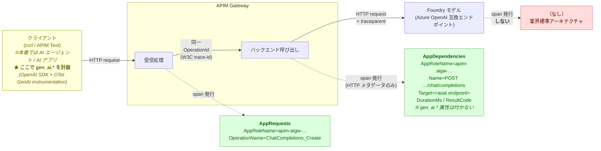

# Lab 6 — OpenTelemetry によるモニタリング / トレーシング

## ゴール

APIM（Azure）と外部 SHGW（Container Apps = AWS 相当）を **W3C `traceparent`** で貫通させ、`AppRequests`（受信）と `AppDependencies`（モデル呼び出し）を同じ `OperationId`（= W3C trace-id）で連結して分散トレースを成立させる。ベンダー別のリクエスト数・トークン消費・レイテンシを **Application Insights + Workbook** で可視化する。

> :information_source: **本 Lab は厳密な E2E（クライアント → バックエンド）ではなく、APIM 以下のホップに限定した分散トレース** です。クライアント側 OTel 計装や Foundry Agent は本 Lab のスコープ外とし、§6-2 で拡張オプションとして講説します。

> :warning: **APIM のテレメトリ出力は OTel/OTLP 非対応です。** APIM は Application Insights **独自インジェスチョン プロトコル**（AI SDK Channel）でテレメトリを送信します。本 Lab のタイトルにある「OpenTelemetry」は **W3C `traceparent` ヘッダーによるトレースコンテキスト伝搬**（OTel が採用した W3C 標準）を指しており、OTel Exporter / OTLP によるテレメトリ送信ではありません。APIM のテレメトリは `AppRequests` / `AppDependencies` / `customMetrics` テーブル（Application Insights スキーマ）に格納され、KQL で参照します。

## 所要時間

約 45 分

## 事前条件

- [Lab 3](./lab3.md) 完了 — `llm-emit-token-metric` ポリシーが動作
- [Lab 5](./lab5.md) 完了 — 外部 SHGW (Container Apps) 経由のリクエストも成功
- Application Insights `appi-aigw-<id>` が APIM に紐付け済み

---

## 6-1. APIM の OTel 設定確認

APIM Portal の Application Insights 連携は **2 つの画面に分かれて** います。両方を確認します。

### (a) Logger 紐付けの確認

Portal → `apim-aigw-<id>` → 左メニュー **監視 > Application Insights**

一覧に `appi-aigw-<id>` が表示されていれば Logger 紐付け済みです。**行をクリックすると Application Insights リソース自体に遷移する** ため、詳細設定は (b) で確認します。表示されていない場合は `+ 追加` から Application Insights `appi-aigw-<id>` を選んで作成してください。

### (b) サンプリング・Verbosity・W3C 連携の確認

Portal → `apim-aigw-<id>` → 左メニュー **APIs > API** → 中央 API 一覧の一番上 **`All APIs`** をクリック → 右ペイン上部タブ **Settings**

下にスクロールすると **Diagnostics Logs** セクションが表示されます。上部のサブタブ **Application Insights / Azure Monitor / Local** のうち、**Application Insights** タブを選択した状態で以下を確認:

| 項目 | 値 |
|---|---|
| Enable | ✓ |
| Destination | `appi-aigw-<id>` |
| Sampling (%) | `100`（ハンズオン中のみ。本番は 5〜10 %） |
| Always log errors | ✓ |
| Log client IP address | ✓（任意） |
| **Support custom metrics** | **✓**（§6-5 のベンダー別トークン メトリクスに必須） |
| Verbosity | **Information**（既定）または **Verbose** |
| **Correlation protocol** | **W3C** |
| Headers to log | （空のままで OK） |
| Number of payload bytes to log | `0`（ハンズオンでは本文は不要） |

> :warning: **Correlation protocol が `Legacy` のままだと §6-2 / §6-4 のトレース連結が成立しません**。`W3C` をクリックして選択し直してください（既定は Legacy のことが多い）。
>
> :warning: **`Support custom metrics` のチェックを忘れない**。これがオフだと `llm-emit-token-metric` ポリシーが emit するベンダー別トークン値が `customMetrics` テーブルに届かず、§6-5 / §6-6 のグラフが空になります。

> :information_source: 左の API 一覧で個別 API（`Bedrock API` / `Echo API` / `OpenAI API`）を選んで `Settings` タブを開くと、その API 単位の上書き設定が見えます。本ラボでは `All APIs` のデフォルト設定だけで OK です（個別 API 側はオーバーライドしない）。

変更があれば下部の **Save** ボタンを押します（反映に 30 秒〜1 分）。設定済みなら何も変更せず画面を離れます。

### (c) APIM の自動 traceparent 付与を確認

(b) で `Correlation protocol = W3C` を有効化すると、APIM は **すべての backend 転送リクエストに W3C 形式の `traceparent` ヘッダを自動で付与** します（カスタム ポリシーは不要）。確認は Trace 機能で行います。

1. APIM Portal → **APIs > OpenAI API** → 上部タブ **Test** → 任意のオペレーション（例: `Creates a model response.`）を選択
2. 画面下部に **Send** と **Trace** の **2 つの送信ボタン** が並んでいます。**`Trace` ボタンをクリック**（Send ではない）。これでトレース計装つきでリクエストが送られます
3. 200 OK が返ったら、HTTP response 上部タブを **Message** から **Trace** に切り替え
4. **`Backend`** セクションを展開 → **`request-forwarder`** ステップ → `request.headers` リストを確認
5. 以下のような W3C 形式ヘッダが入っていれば成功:

   ```json
   { "name": "traceparent", "value": "00-1c703ddf7c42e2d2345f63b1e52c8738-6c86ba43a5601893-01" }
   ```

   形式: `00-<32 hex の trace-id>-<16 hex の span-id>-01`

> :information_source: `traceparent` は `Inbound` 側のポリシー実行ログには **出ません**。APIM 内部の relay 層が `request-forwarder` 直前に注入するため、必ず `Backend → request-forwarder → request.headers` で確認してください。

> :warning: `traceparent` が見当たらない場合は (b) の **Correlation protocol が `W3C` 以外** になっている可能性が高いです。`Legacy` のままだと代わりに `Request-Id` / `Request-Context`（古い App Insights プロトコル）が付与されます。

## 6-2. ダウンストリームの OTel 計装

APIM が `traceparent` を Foundry へ転送したあとに何が記録されるかを、まず **業界共通のアーキテクチャ** から押さえます。

### モデル推論サービスは「span を出さない側」

Azure OpenAI / AWS Bedrock / OpenAI 直接 API / Anthropic API — どれも **モデル推論サービス自身は分散トレースの span を発行しません**。これは GenAI 固有の仕様ではなく、Azure SQL や Cosmos DB と同じ **「呼び出された側ではなく呼び出し側が dependency span を記録する」** という Application Insights / OpenTelemetry の標準モデルに従っているからです。

したがって本 Lab の構成（APIM → Foundry の Azure OpenAI 互換エンドポイント直接呼び出し）で観測されるモデル呼び出しは:



つまり **「モデル呼び出しの HTTP レベルの記録」は APIM 側の `AppDependencies` として完結します**（エンドポイント URL、レイテンシ、ステータスコード）。「Foundry が span を出さない＝不完全」ではなく、Application Insights の dependency span モデルに忠実な設計です。

> :warning: **APIM は LLM を意識せず「ただ HTTP で backend を呼んだ」としか記録しません。** `gen_ai.system` / `gen_ai.request.model` / `gen_ai.usage.input_tokens` / `gen_ai.usage.output_tokens` などの **GenAI セマンティクス規約属性は APIM の Application Insights logger は自動では付与しません。**本 Lab の構成だと 「Azure OpenAI を呼んで 1.2 秒かかった」はわかるものの、**トークン数やモデル名といった LLM 固有情報は追跡されません**。これを取りたい場合の現実的な選択肢は§6-2 末尾の拡張オプションテーブルを参照。

### Foundry Agent を入れると何が増えるか

Foundry **Agent Service** を経由した場合に追加で出るのは、モデル内部 span ではなく **「モデルの上のアプリケーション層」** の span です（agent reasoning / tool call / retry など）。

公式仕様 ([Set up tracing in Microsoft Foundry](https://learn.microsoft.com/azure/foundry/observability/how-to/trace-agent-setup#instrument-ai-agents)) の明文:

> Foundry automatically logs server-side traces for **Prompt agents, Host agents, and workflows** in the Foundry portal.

| Foundry の利用形態 | Foundry リソース由来の span | GA / Preview | 計装方法 | **デフォルトで APIM 経由するか** | **エンタープライズ本番適性** |
|---|---|---|---|---|---|
| **Azure OpenAI 互換エンドポイント直接** (本 Lab) | **発行されない** ※モデル呼び出しは APIM 側 `AppDependencies` で記録 | — | アプリ層を経由しないので追加 span なし（モデル呼び出しの記録自体は欠落しない） | ✅ **APIM 経由**（本 Lab の主構成） | ✅ **本番向き**（APIM ポリシーで token-limit / content-safety / vendor routing / 監査が効く） |
| **Prompt agent**（ポータルでノーコード作成） | **自動発行**（コード変更ゼロ、agent reasoning / tool call が見える） | **GA** | App Insights を接続するだけ | ❌ **バイパス**（Foundry 内蔵 model deployment に直結） | ❌ **検証 / PoC 用途のみ**。APIM ポリシー制御点を通らないため、本番ガバナンス要件下では採用不可（※ Foundry Model Connection に APIM を登録すれば経由可能だが、結局自前アプリと同等の設計工数になる） |
| **Workflow agent** | 自動発行（コード変更ゼロ） | Preview | App Insights を接続するだけ | ❌ **バイパス**（Prompt agent と同構造） | ❌ **検証 / PoC 用途のみ**。Preview なので SLA / サポート観点でも本番不可 |
| **Hosted agent**（自前コンテナーを Foundry runtime に乗せる） | **agent 呼び出し外枠 span のみ自動**（Foundry runtime + protocol library が発行）<br>LLM 呼び出し / ツール / フレームワーク内部の **詳細 span は SDK 計装で付与**（自動ではない） | **GA** | App Insights を接続 + フレームワーク用 tracer を attach。<br>例 (LangGraph、実質 3 行):<br>`pip install langchain-azure-ai[opentelemetry]`<br>`tracer = AzureAIOpenTelemetryTracer(agent_id="...")`<br>`agent.with_config({"callbacks": [tracer]})` | ✅ **アプリコードで `OpenAI SDK` の `base_url` を APIM に向ければ APIM 経由**（Foundry runtime に強制バイパスはない） | ✅ **本番向き**。Foundry runtime に乗せることで agent lifecycle（デプロイ / スケーリング / 認証 / quota / Connection 管理 / Knowledge Index / agent 外枠 span の自動発行）が大幅に楽になる。LLM 呼び出し経路と `gen_ai.*` 計装はアプリ層 (SDK 経由) で自前実装する前提 |

### 本 Lab で観測できる範囲

| 区間 | 観測手段 | 本 Lab で観測可能か |
|---|---|---|
| クライアント → APIM | クライアント側 OTel 計装（`azure-monitor-opentelemetry` 等） | ❌ 未実装 |
| APIM 内部（受信 → backend 送信） | APIM の Application Insights ロガー (§6-1) | ✅ `AppRequests` |
| APIM → Foundry モデルへの HTTP 呼び出し（URL / レイテンシ / status、`gen_ai.*` なし） | APIM の Application Insights ロガー | ✅ `AppDependencies`（**APIM 視点**） |
| `gen_ai.system` / `gen_ai.request.model` / `gen_ai.usage.*` など **GenAI セマンティクス規約属性** | APIM の標準 logger では付かない（アプリ側 OTel 計装 / APIM の `azure-openai-emit-token-metric` ポリシーが必要） | ❌ 本 Lab では出ない |
| モデル内部処理 | モデル推論サービス側では発行なし（業界共通） | ❌ 発行されない（仕様） |
| Foundry アプリ層処理（agent reasoning / tool call） | Foundry Agent Service 経由ではないため発行なし | ❌ 本 Lab 構成では出ない |

したがって本 Lab で達成するゴールは **「APIM 単一ノード内で W3C trace-id が `AppRequests`（受信）と `AppDependencies`（送信 = モデル呼び出し）を同じ `OperationId` で連結している」** ことの確認です。APIM ホップで見えるのは **APIM 視点の 2 span**（受信 + dependency）で、クライアント側 span は本 Lab の構成では発行されません。**厳密な意味の E2E（クライアント → バックエンド）にはクライアント側 OTel 計装が必須** で、本 Lab では§6-2 末尾の拡張オプションとして位置付けます。

### 拡張オプション: 真の E2E / 複数ノード横断 trace を実現するには

本 Lab では実装しませんが、APIM の上流・下流それぞれに以下を追加するとトレースのスコープが広がります。

| 拡張 | 追加で何が見える | 工数 |
|---|---|---|
| **クライアント側 OTel 計装**（`azure-monitor-opentelemetry` を入れて HTTP クライアントから APIM を呼ぶ） | クライアント span が同じ `OperationId` で `union` クエリに 1 行追加 → **「クライアント → APIM → モデル」の厳密な E2E** が成立 | 数行 |
| **アプリ側 OTel GenAI 計装** （`opentelemetry-instrumentation-openai-v2` / `Azure.AI.OpenAI` + OTel exporter 等） | dependency span に **`gen_ai.system` / `gen_ai.request.model` / `gen_ai.usage.input_tokens` / `gen_ai.usage.output_tokens`** が自動付与 → トークン数・モデル名がトレースで追跡可能 | パッケージ追加～数行 |
| **APIM ポリシー `azure-openai-emit-token-metric`** | App Insights にカスタムメトリクスとしてトークン消費量を送信（span の属性ではなく `customMetrics` 側、コード変更不要） | ポリシー 1 行 |
| **Foundry Prompt agent 経由に置き換え** :warning: | Foundry が自動で agent / tool call span を発行 → **アプリ層が trace に乗る**（ただしクライアント側 span がない限り厳密な E2E にはならない）。**※デフォルトでは APIM をバイパスするため、本 Lab で構築した APIM ポリシー制御 (token-limit / content-safety / vendor routing / 監査) が一切効かなくなる**。本番運用には不適切で、検証 / PoC / 社内クローズドツール用途に限る。Foundry Model Connection に APIM を登録すれば経由可能だが、その場合は自前アプリ層と同等の設計工数になる | API ルーティング変更 |

本 Lab ではいずれも実装しません。

> :information_source: 拡張パターンと業界標準の dependency span モデルの詳細は [docs/Otel_Info.md](../Otel_Info.md) を参照。

## 6-2-b. APIM trace の検証（親子 span の連結を確認）

ここまでで APIM 側に App Insights ロガー (§6-1) と W3C trace context (§6-1(b)) が設定されています。実際に APIM 経由でリクエストを流し、`AppRequests` (Ingress) と `AppDependencies` (Egress = LLM Call) が **同一 trace-id で親子 span として連結している** ことを KQL で確認します。

### 動作確認

1. APIM Portal → **APIs > OpenAI API** → **Test** タブで任意のオペレーションを **Send** ボタンで数回（3〜5 回）実行
2. 1〜2 分待ってから Azure Portal → **`log-aigw-<id>`** （Lab 1 で作成した Log Analytics ワークスペース）→ 左メニュー **ログ** を開く

   > :information_source: `appi-aigw-<id>` (App Insights) は workspace-based のため、データは `log-aigw-<id>` に格納されます。クエリは LA ワークスペース側で実行するのが確実です。

3. APIM 側のリクエストを `AppRequests` で確認:

   ```kusto
   AppRequests
   | where TimeGenerated > ago(10m)
   | where AppRoleName startswith "apim-aigw"
   | project TimeGenerated, OperationId, OperationName, Url, ResultCode, DurationMs, AppRoleName
   | order by TimeGenerated desc
   ```

4. 結果から `OperationId` を 1 つコピーして、**同じ trace-id で APIM の `AppRequests` と `AppDependencies` が親子 span として連結しているか** を確認します。`Id`（span-id）と `ParentId`（親 span-id）を `project` に含めるのがポイントです。さらに `Type` 列だけだと「受信 / LLM 呼び出し」が直感的に分かりにくいので、`SpanRole` 列で **APIM の受信処理 (Ingress)** と **バックエンド呼び出し (Egress = LLM Call)** をラベル付けします:

   ```kusto
   union 
     (AppRequests   | extend Target = ""),
     (AppDependencies | extend Target = tostring(Target))
   | where TimeGenerated > ago(15m)
   | where OperationId == "<手順 3 でコピーした OperationId>"
   | extend SpanRole = case(
       Type == "AppRequests",    "① APIM 受信 (Ingress)",
       Type == "AppDependencies","② バックエンド呼び出し (Egress = LLM Call)",
       "?")
   | project TimeGenerated, SpanRole, Id, ParentId, Name, Target, DurationMs, ResultCode, AppRoleName
   | order by TimeGenerated asc
   ```

5. **`AppRoleName` が `apim-aigw-<id>` の行が 2 行返り、かつ親子関係が成立していれば成功** です。期待される並び:

   | SpanRole | Id (16 hex) | ParentId | Name | Target | DurationMs |
   |---|---|---|---|---|---|
   | **① APIM 受信 (Ingress)** | `<span-id-A>` | `<OperationId と同じ 32 hex>` (= root span) | `POST /openai/openai/deployments/.../chat/completions` | (空) | ~1222 ms |
   | **② バックエンド呼び出し (Egress = LLM Call)** | `<span-id-B>` | **`<span-id-A>`** ← AppRequests の Id を指す | `POST /openai/deployments/.../chat/completions` | `aif-aigw-<id>.openai.azure.com` | ~1221 ms |

   読み方:

   - **② の `ParentId` = ① の `Id`** → APIM 内部で「受信処理 → バックエンド呼び出し」が親子 span として張られている (= 本 §6-2 のゴール)
   - **② の `Target`** が Foundry の Azure OpenAI 互換エンドポイントを指す → これが LLM Call の宛先
   - **② の `DurationMs` ≈ ① の `DurationMs`** → レイテンシのほぼ全てが LLM 呼び出しに費やされている

6. (任意) 視覚的に span 並びをガントチャートで見たい場合は、Azure Portal → **`appi-aigw-<id>`** (Application Insights) → 左メニュー **検索** を開き、画面上部のフィルター欄に手順 3 でコピーした `OperationId` を貼り付けて検索 → ヒットした行をクリックすると **エンドツーエンドトランザクションの詳細** が開き、同じ trace の span がガントチャートで並びます。本 Lab 構成では `AppRequests` (Ingress) + `AppDependencies` (Egress) の 2 段が見えます。

## 6-2-c. (任意) Foundry に Application Insights を接続する

> :information_source: **本ハンズオンでは省略可能** です。本 Lab の構成（APIM → Foundry の AOAI 互換エンドポイント）では Foundry 側から span は発行されないため、接続しても観測される span は増えません。**将来 Foundry Agent (Prompt / Workflow / Hosted) を追加検証する際に、Foundry 側で発行される agent / tool call span を同じ App Insights で受け取れるように下準備しておきたい場合**に実施してください。既に接続済みの場合は、画面で確認だけして §6-3 に進んでください。
>
> :warning: **Application Insights への接続は Azure Portal ではなく Foundry ポータル側で行います**。Foundry リソース (`aif-aigw-<id>`) の Azure Portal サイドメニュー（監視配下）には **警告 / メトリック / 診断設定 / ログ しかなく、「Application Insights」項目は存在しません**。

### 手順

1. Azure Portal → `aif-aigw-<id>`（Lab 2 で作成した Foundry リソース）を開く
2. **概要** ページ上部の **「Foundry ポータルに移動」** ボタンをクリック → Foundry ポータル (ai.azure.com) が新しいタブで開く
3. 画面左上のパンくずが `Microsoft Foundry / proj-default-<id>` になっていることを確認
4. 画面右上のトグル **「新しい Foundry」** が **オン** になっていることを確認
5. 画面右上のトップ ナビから **操作** をクリック → 「**概要 [プレビュー]**」ページが開く（左サイドバー: 概要 / 資産 / コンプライアンス / クォータ / 管理者）
6. 左サイドバーから **管理者** をクリック → プロジェクト ページ（`proj-default-<id>`、ラベル「既定のプロジェクト」）が開く
7. ページ中段のタブから **接続されているリソース** を選択
8. 右側の **接続の追加** ボタン（紫）をクリック → 「**接続を選択してください**」ダイアログが開く
9. **その他のリソースの種類** カテゴリの **Application Insights**（テレメトリ）を選択 → **続行**
10. 次の画面で以下を選択:

    | 項目 | 値 |
    |---|---|
    | サブスクリプション | Lab 1 で使ったものと同じ |
    | Application Insights | `appi-aigw-<id>` |

11. **接続** （または **追加**）をクリックして保存
12. **接続されているリソース** タブ一覧に `appi-aigw-<id>` が表示されることを確認

> :information_source: 接続しても本 Lab 構成では新しい span は出ません。確認は将来 Foundry Agent を追加したときに行います。

## 6-3. 外部 SHGW (Container Apps) のテレメトリ

> :information_source: **用語整理**: 本セクション以降では以下の呼び分けを使います。
>
> | 用語 | 実体 |
> |---|---|
> | **cloud APIM**（マネージド ゲートウェイ） | `apim-aigw-<id>` の APIM 本体に組み込まれた既定ゲートウェイ。Azure 内で Microsoft が運用 |
> | **SHGW**（自己ホスト型ゲートウェイ / Self-Hosted Gateway） | `ca-shgw-<id>` で動く APIM Gateway コンテナ。Lab 5 で構築。APIM インスタンスに紐付き、同じ API 定義・ポリシー・ロガー設定を継承 |
>
> 両者は **1 つの APIM インスタンスを共有する 2 つのゲートウェイ** という関係で、本ラボでは OpenAI 系 = cloud APIM 経由、Bedrock 系 = SHGW 経由、というルーティングを Lab 5 で設定済みです。

SHGW は **cloud APIM のコントロールプレーンを経由せず、コンテナ自身が直接** Application Insights / Azure Monitor へテレメトリを送信します。本ハンズオンの SHGW (`ca-shgw-<id>`) は Lab 5 で APIM の Application Insights ロガー設定を継承しているため、§6-1(a/b) の設定が SHGW にも自動配布され、追加の計装作業は不要です。

### テレメトリの送信経路

```
[SHGW container]  ──直接 outbound 443──▶  Application Insights
                                          (dc.services.visualstudio.com 等)
        │
        └── stdout / stderr ──▶ Container Apps Log Analytics（コンテナログのみ）
```

SHGW は以下 2 系統のテレメトリを並行して送ります:

| 送信先 | 内容 | 送信元 |
|---|---|---|
| **Application Insights** (`appi-aigw-<id>`) | リクエスト / 依存関係 / トレース / メトリクス（cloud APIM と同じスキーマ） | SHGW コンテナが直接 HTTPS |
| **Log Analytics ワークスペース** (`log-aigw-<id>`) | コンテナの stdout / stderr (gateway 起動ログ、エラー、起動時診断) | Container Apps ランタイムが自動収集（Container Apps 環境の Logs 設定で `log-aigw-<id>` を指定済み） |

> :information_source: **App Insights 側に流れるのはリクエスト テレメトリ**、Log Analytics 側はコンテナのオペレーション ログ、という役割分担。両者は補完関係で、SHGW のリクエスト性能・トレースは **App Insights 側で見る** のが基本です。

### W3C traceparent / OTel 連結の挙動

SHGW は cloud APIM とまったく同じ APIM Gateway バイナリを使うため、§6-1(b) の `Correlation protocol = W3C` 設定は config service 経由で SHGW にも自動配布されます。結果:

| 観点 | 挙動 |
|---|---|
| **SHGW → backend (Foundry / Container App) への `traceparent` 自動付与** | ◯ cloud APIM と同じ動作 |
| **App Insights 内での cloud APIM ↔ SHGW span の連結** | ◯ `operation_Id` フィールド = W3C trace-id にマッピングされるため、同一 trace 内に並ぶ |

> :information_source: SHGW は cloud APIM とまったく同じ Gateway バイナリ + 同じ Application Insights ロガー設定なので、テレメトリ送信仕様（ワイヤープロトコル / 受信エンドポイント / OTLP 非対応 等）も cloud APIM と完全に同じです。ここでは SHGW 固有の挙動（場所が違うことで意識すべき点）にフォーカスしています。

### テレメトリの送信確認

1. **SHGW 経由でリクエストを送信**（Lab 5 §5-7 と同じコマンド）:

   ```pwsh
   $URL = "https://ca-shgw-<id>.xxxxxxxx-xxxxxxxx.eastus.azurecontainerapps.io"
   $KEY = "<Lab 3 で取得したサブスクリプションキー>"
   $MODEL_ID = "us.anthropic.claude-3-5-haiku-20241022-v1:0"
   $tmp = New-TemporaryFile
   '{"messages":[{"role":"user","content":[{"text":"hello SHGW telemetry test"}]}],"inferenceConfig":{"maxTokens":50}}' |
     Set-Content -Path $tmp -Encoding utf8 -NoNewline
   curl.exe -i -X POST "$URL/bedrock/model/$MODEL_ID/converse" `
     -H "api-key: $KEY" `
     -H "Content-Type: application/json" `
     --data-binary "@$tmp"
   Remove-Item $tmp -Force
   ```

2. 1〜2 分待ってから Log Analytics (`log-aigw-<id>`) → **ログ** を開く

3. **SHGW の AppRoleName を確認**（cloud APIM と異なる値になる）:

   ```kusto
   AppRequests
   | where TimeGenerated > ago(10m)
   | summarize count() by AppRoleName
   ```

   期待値:

   | AppRoleName | 説明 |
   |---|---|
   | `apim-aigw-<id>` | cloud APIM（マネージド ゲートウェイ）|
   | `apim-aigw-<id> <gateway-resource-name>` | SHGW（例: `apim-aigw-user99 aws-ap-northeast-1`）|

   SHGW の AppRoleName は **`{APIMサービス名} {SHGWゲートウェイリソース名}`**（スペース区切り）になります。

4. **SHGW のリクエスト span を確認**:

   ```kusto
   AppRequests
   | where TimeGenerated > ago(10m)
   | where AppRoleName != "apim-aigw-<id>"   // cloud APIM を除外。SHGW は名前にスペースが入る
   | project TimeGenerated, OperationId, OperationName, Url, ResultCode, DurationMs, AppRoleName
   | order by TimeGenerated desc
   | take 5
   ```

   結果の `OperationId` を 1 つコピーして span 連結を確認:

   ```kusto
   union
     (AppRequests     | extend Target = ""),
     (AppDependencies | extend Target = tostring(Target))
   | where TimeGenerated > ago(15m)
   | where OperationId == "<コピーした OperationId>"
   | extend SpanRole = case(
       Type == "AppRequests",    "① SHGW 受信 (Ingress)",
       Type == "AppDependencies","② バックエンド呼び出し (Egress)",
       "?")
   | project TimeGenerated, SpanRole, Id, ParentId, Name, Target, DurationMs, ResultCode, AppRoleName
   | order by TimeGenerated asc
   ```

   ✅ SHGW の `AppRoleName` で `AppRequests`（①）と `AppDependencies`（②）の 2 行が返り、② の `ParentId` = ① の `Id` であれば span 連結が成立しています。

5. **コンテナログ（Log Analytics）を確認**（オプション）:

   ```kusto
   ContainerAppConsoleLogs_CL
   | where TimeGenerated > ago(10m)
   | where ContainerAppName_s == "ca-shgw-<id>"
   | project TimeGenerated, Log_s
   | order by TimeGenerated desc
   | take 20
   ```

   SHGW の stdout/stderr（起動ログ・リクエスト処理ログ）が返れば、Container Apps ランタイム経由のログ収集も正常です。

### :warning: 通信断時の挙動（重要）

SHGW は **fail static** 設計で、Azure クラウドへの接続が切れても **リクエスト処理自体は継続** しますが、テレメトリは失われます。挙動を整理:

| 期間 | リクエスト処理 | 設定更新 | テレメトリ |
|---|---|---|---|
| **通信断発生時** | ◯ in-memory（または backup volume）の最新設定で継続稼働 | ✗ 受信不可 | ✗ App Insights / Azure Monitor へ送信不可 |
| **通信断中** | ◯ 継続。新規 SHGW Pod は backup volume があれば起動可、なければ起動不可 | ✗ 蓄積される（クラウド側に） | ✗ **失われる**（永続バッファは公式仕様上保証されない）|
| **通信回復時** | ◯ 影響なし | ◯ 蓄積分を一括取得して反映 | ◯ 以降の分は再開（**断中の分は遡及されない**）|

#### 含意

- **本番監視には Application Insights だけでなく、SHGW 自身の死活監視 (Container Apps の Liveness / Readiness) を別系統で必須化**: テレメトリが届かない＝SHGW が動いていない、ではない（テレメトリだけ落ちて trace は出ない可能性）
- **コンテナログ (Log Analytics)** は Container Apps ランタイム側が拾うため、SHGW → Azure App Insights 経路が切れていても Container Apps → Log Analytics 経路は別経路で生き残る可能性がある（通信障害の切り分けに有用）
- **長時間の通信断はリクエスト テレメトリ消失リスク**。SLA 監査要件がある場合は SHGW 側でローカル ログ (syslog / Prometheus) を独自に永続化する設計を検討（[公式: ローカル メトリクス / ログ設定](https://learn.microsoft.com/azure/api-management/how-to-configure-local-metrics-logs)）

> :information_source: 本番で AWS / オンプレに SHGW を置く際は、コンテナ ログの送信先を CloudWatch / OTel Collector に差し替えれば OK。**ただし APIM の `requests` テーブルに見せたいなら App Insights 経路は維持** が前提（APIM スキーマで KQL 集計したい場合）。

## チェックリスト

- [ ] APIM のサンプリングが 100 % / Verbose
- [ ] App Insights の **トランザクション検索**（または KQL `union AppRequests, AppDependencies | where OperationId == "..."`）で APIM の受信 span と dependency span が同じ `OperationId` で連結して見える
- [ ] 外部 SHGW 経由のトレースも同じトレース ID で連続している
- [ ] **メトリクス** 画面で vendor 別のトークン消費が時系列で見える
- [ ] Workbook `aigw-overview` に 4 タイルが揃った
- [ ] Container Apps のコンソールログが Log Analytics (`ContainerAppConsoleLogs_CL`) で検索できる

完了したら [Lab 7 — クリーンアップ](./lab7.md) へ。
